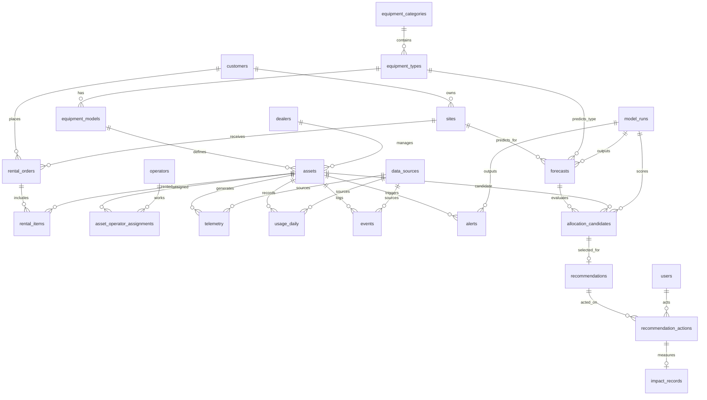

# FleetIQ - Canonical Data Model & PostgreSQL Schema Design (PHASE 3)

## 1. High-Level Entity Relationship Structure

## 2. Table Definitions

### A. DATA / ML GOVERNANCE
1. **`data_sources`**: Tracks the origin of data to distinguish between `REAL`, `DERIVED`, and `SIMULATED`.
   - `id` (UUID, PK), `name` (VARCHAR), `source_type` (VARCHAR - e.g. REAL, SIMULATED), `description` (TEXT).
2. **`model_runs`**: Tracks ML model versions for explainability.
   - `id` (UUID, PK), `model_name` (VARCHAR), `version` (VARCHAR), `metrics` (JSONB).

### B. MASTER DATA
3. **`equipment_categories`**: E.g., 'Heavy Earthmoving'.
   - `id` (UUID, PK), `name` (VARCHAR).
4. **`equipment_types`**: E.g., 'Excavator', 'Bulldozer'.
   - `id` (UUID, PK), `category_id` (FK), `name` (VARCHAR).
5. **`equipment_models`**: E.g., 'Cat 320'.
   - `id` (UUID, PK), `type_id` (FK), `manufacturer` (VARCHAR), `model_name` (VARCHAR).
6. **`dealers`**: Local dealerships managing assets.
   - `id` (UUID, PK), `name` (VARCHAR).
7. **`customers`**: Entities renting equipment.
   - `id` (UUID, PK), `name` (VARCHAR).
8. **`sites`**: Project locations (e.g., S001, S003).
   - `id` (UUID, PK), `customer_id` (FK), `name` (VARCHAR), `latitude` (FLOAT), `longitude` (FLOAT).
9. **`operators`**: Personnel operating machines (e.g., OP101).
   - `id` (VARCHAR, PK - maps to OP101), `name` (VARCHAR), `status` (VARCHAR).
10. **`users`**: Application users (Fleet Managers).
    - `id` (UUID, PK), `role` (VARCHAR), `name` (VARCHAR).
11. **`assets`**: Core equipment entities (e.g., EQX1001).
    - `id` (VARCHAR, PK - maps to EQX1001), `model_id` (FK), `dealer_id` (FK), `status` (VARCHAR).

### C. RENTAL
12. **`rental_orders`**: Parent object for a customer rental event.
    - `id` (UUID, PK), `customer_id` (FK), `site_id` (FK), `status` (VARCHAR).
13. **`rental_items`**: Line item representing the actual rental of an asset. Contains the challenge's check-out/in dates.
    - `id` (UUID, PK), `rental_order_id` (FK), `asset_id` (FK), `checkout_date` (DATE), `checkin_date` (DATE), `daily_rate` (DECIMAL).
14. **`asset_operator_assignments`**: Connects assets to operators.
    - `id` (UUID, PK), `asset_id` (FK), `operator_id` (FK, nullable), `start_date` (DATE).

### D. OPERATIONAL
15. **`telemetry`**: Real-time GPS and engine states (Will be mostly `SIMULATED` for R1).
    - `id` (UUID, PK), `asset_id` (FK), `timestamp` (TIMESTAMP), `engine_on` (BOOLEAN), `lat` (FLOAT), `lng` (FLOAT), `data_source_id` (FK).
16. **`usage_daily`**: The daily aggregates from the challenge dataset.
    - `id` (UUID, PK), `asset_id` (FK), `date` (DATE), `engine_hours` (FLOAT), `idle_hours` (FLOAT), `operating_days` (INT), `data_source_id` (FK).
17. **`events`**: System events (Checked Out, Engine Started, Anomaly Detected).
    - `id` (UUID, PK), `asset_id` (FK), `event_type` (VARCHAR), `timestamp` (TIMESTAMP).

### E. INTELLIGENCE
18. **`alerts`**: Flags issues like Underutilization or Overdue.
    - `id` (UUID, PK), `asset_id` (FK), `type` (VARCHAR), `severity` (VARCHAR), `status` (VARCHAR).
19. **`forecasts`**: Predicted future demand for a site and equipment type.
    - `id` (UUID, PK), `site_id` (FK), `equipment_type_id` (FK), `forecast_date` (DATE), `predicted_quantity` (INT), `model_run_id` (FK).
20. **`allocation_candidates`**: Evaluated assets for a specific forecast/opportunity.
    - `id` (UUID, PK), `forecast_id` (FK), `asset_id` (FK), `score` (FLOAT), `reasoning` (JSONB).
21. **`recommendations`**: The final AI suggestion (e.g., Reassign EQX1007 to S003).
    - `id` (UUID, PK), `selected_candidate_id` (FK - references `allocation_candidates`), `action_type` (VARCHAR), `confidence` (FLOAT), `status` (VARCHAR).
22. **`recommendation_actions`**: Records the human-in-the-loop decision (APPROVE/REJECT).
    - `id` (UUID, PK), `recommendation_id` (FK), `user_id` (FK), `action` (VARCHAR), `timestamp` (TIMESTAMP).
23. **`impact_records`**: Measures the business outcome of an approved recommendation.
    - `id` (UUID, PK), `action_id` (FK), `metric` (VARCHAR - e.g., 'Idle Reduction'), `estimated_value` (FLOAT), `actual_value` (FLOAT), `is_illustrative` (BOOLEAN).

## 3. Data Integrity & Constraints
- **Foreign Key Dependency Order:** Governance -> Master Data -> Rental -> Operational -> Intelligence.
- **Constraints:** `usage_daily` has a UNIQUE constraint on `(asset_id, date)`. `telemetry` timestamps must be <= CURRENT_TIMESTAMP. 
- **Financial Rule:** All monetary fields (`daily_rate` in `rental_items`, estimated savings in `impact_records`) are tagged as `is_illustrative` or configured via app settings, never hardcoded Caterpillar rates.

## 4. Flow Trace: The Signature Workflow (EQX1007)
1. **Underutilized Asset:** `usage_daily` records 0 engine hours, 12 idle hours for `EQX1007`. `alerts` table generates a 'High Idle' alert.
2. **Forecast Future Demand:** `forecasts` table predicts 1 Excavator needed at `S003` next week.
3. **Find & Rank Candidates:** `allocation_candidates` generates records for available Excavators: `EQX1007` (Score: 91), `EQX1004` (Score: 45).
4. **Create Recommendation:** `recommendations` row created linking to `EQX1007`'s candidate record, proposing "REASSIGN".
5. **Manager Approves:** Fleet Manager clicks approve. `recommendation_actions` logs the `user_id` and 'APPROVED'.
6. **Action Recorded:** `events` table logs 'REASSIGNED'. `rental_items` is updated/closed for the old site, new assignment created.
7. **Impact Measured:** `impact_records` calculates estimated $ exposure saved and logs it as an illustrative estimate.

## 5. Seed Strategy (Challenge Dataset)
The 7 official rows will seed `assets`, `sites`, `operators`, `rental_items`, `asset_operator_assignments`, and `usage_daily`. Since the challenge data lacks explicit Customers and Models, we will generate placeholder generic categories (e.g., `Customer A`, `Generic Excavator Model`) linked strictly to the challenge IDs (`EQX1001`-`EQX1007`, `S001`-`S006`, `OP101`-`OP301`) to maintain complete referential integrity.
